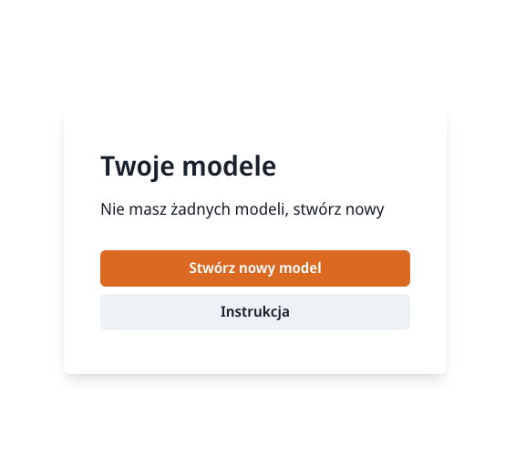

# Implementation of a business process mining tool
This tool was a basis for creation of the bachelor thesis "Design and implementation of a business process
mining tool"
# Prerequisites
- Node.js >= 16 with npm 7 (will work on other versions, not tested)
- Python 3.7+
- Environment supporting unix shell scripts (components can be built and run on other systems, helpers are written in shell scripts). M1 macs should work through the miniforge python distribution, however the setup process is error prone, therefore it is not explained in this docs. Please open an issue if you need help.

# Installation
Install all required packages for the ui, session and api components by running the `source install` command. Source is needed as the venv must be created for the current running shell

# Development
Starting both ui and api components in parallel is achieved by sourcing the dev script - `source dev`. You may be prompted to install `concurrently` - a node package that runs multiple tasks in parallel. In dev mode, the gunicorn http server is not used for the sake of simplicity.
# Deployment
To run a production version of the tool, you will first have to build of the required assets. This process is extracted into a shell script, simply run `source build` and wait for the installation to complete. Then run the `source prod` command to start the gunicorn worker processes, sessions service and the built version of the ui. The ports are unchanged from the development versions.

Ui will be started on localhost:3000, the api is hosted on localhost:5000 and the session service on localhost:5001

# User guide
To start working with the tool, visit the ui address shown in the earlier sections of the README. 

The first step is to select available model from the menu, or to create a new one by using the button at the bottom. The model name will be created automatically, remember to take your time and enjoy the cool title. 

After creating a model, you will be taken to the control panel. First, you will have to upload a model file. Simply drag a XES or CSV file into the specified file upload, and wait for the process to finish. Next, another action button will unlock, enabling you to discover process models.

## Process discovery
If the event log is uploaded, you can select the second available button responsible for the process discovery. A modal will be shown, giving you four options to select. After chosing an algorithm, you will be allowed to start process discovery. The progress information will be streamed in the dialog box below, and after waiting for the process to finish, the modal will close and you will be informed about the process completion. If there are any errors, another toast will pop up with an appropriate error message. Finally, the remaining buttons should unlock after the model is discovered correctly.

## Model inspection, editing and exports
The third action you can do, assuming the log is uploaded and the model discovered, is to view and edit the discovered model. After navigating to the model editor through the third button, you will be presented with the bpmn viewer. You can traverse the graph and edit it, and after you are satisfied with the result, clicking the save button in the bottom-right corner of the screen will store the modified model on the server. You can then export the edited BPMN diagram by going back to the control panel and export it using the last button in the menu.

## Metrics and additional statistics
When the model is generated, you can view its metrics, such as simplicty and generalization. After navigating to the metrics screen through the fourth button, metrics will be shown. There is also a special button. By clicking it, you will trigger the generation of additional statistics. They are all generated in form of svg files, so after waiting for a moment, the ui will trigger the download of a zip file that contains of all created diagrams.

Visual exploration of the tool, with the actions described in this section are shown on a video below.

https://user-images.githubusercontent.com/11617741/148853991-14d5bfb0-7098-42f7-a9be-67a18c32251a.mp4

